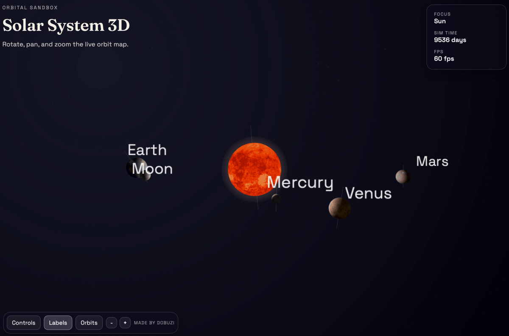
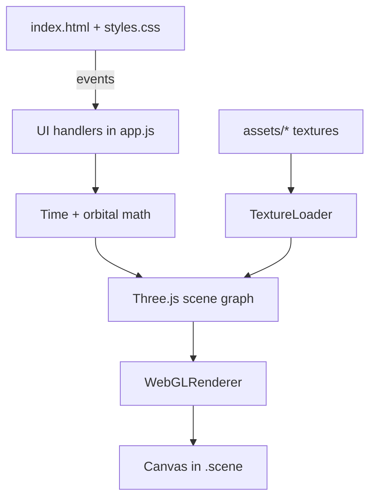

# Solar Simulator

A lightweight, offline-friendly 3D solar system simulator built with Three.js. It renders planetary orbits, rotation, lighting highlights, labels, and key controls in a single static page that works on desktop and mobile.



## Live Demo
- https://dobuzi.github.io/solarSimulator/
- [Full video](assets/Solar%20System_Video.mov)

## Features
- Realistic orbital elements (heliocentric orbits with inclination)
- Sun/planet/major moon rendering with highlights and labels
- Touch-friendly orbit, pan, and pinch-zoom camera controls
- Toggleable orbit trails and adjustable time/orbit scales
- Static assets for offline use and GitHub Pages deployment

## Specification
- Rendering: Three.js WebGL renderer, physically-inspired lighting with sun highlight shader
- Simulation: Keplerian orbital elements (J2000-ish), axial rotation per body, satellite orbits
- Camera: orbit/pan/zoom with touch gestures, focus targets (Sun/planets/Moon), iso/top/side presets
- UI: single-page overlay controls, mobile-first sizing, collapsible control panel
- Assets: local textures under `assets/` with 1k fallbacks for mobile performance

## Architecture


Key modules in `app.js`:
- Data: planet definitions, orbital elements, texture map
- Simulation: Kepler solver, heliocentric position, satellite offsets
- Rendering: scene construction, highlights, rings, labels, trails
- Interaction: raycast focus, pointer/touch camera controls, UI bindings

## Project Structure
- `index.html`: App shell and UI panels
- `styles.css`: Glass UI styling and layout
- `app.js`: Rendering, physics, controls, and data
- `assets/`: Textures and images
- `vendor/`: Third-party libraries (Three.js)

## Getting Started
This is a static site. Run a local server to avoid CORS issues with textures.

```bash
# Python
python -m http.server 8080

# Node (if installed)
npx serve .
```

Then open `http://localhost:8080`.

## Tests
Run unit tests for the orbital math core:

```bash
npm test
```

## Controls
- Drag: orbit camera
- Right-drag / Shift-drag: pan
- Scroll or pinch: zoom
- Use the `Controls` panel to adjust time scale, orbit scale, and view presets
- Toggle `Labels` and `Orbits` from the mini bar

## Configuration Notes
- Textures live under `assets/` and are loaded at runtime; keep paths relative.
- Mobile performance is tuned via lower texture sizes and reduced geometry.
- The camera distance slider is tuned for touch-friendly control.

## Deployment
This project is compatible with GitHub Pages as-is. Ensure all assets are committed and paths are relative.

## License
MIT License.
